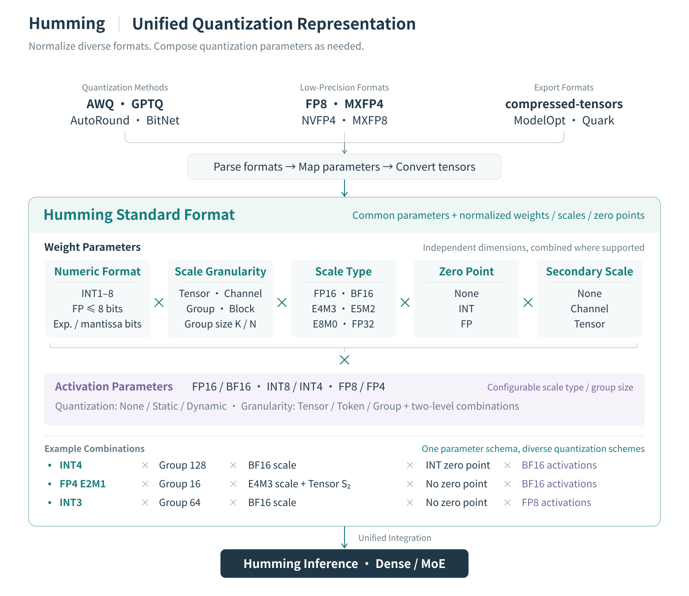
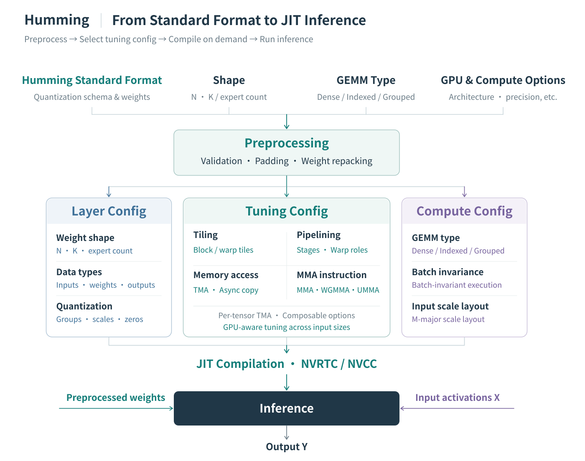
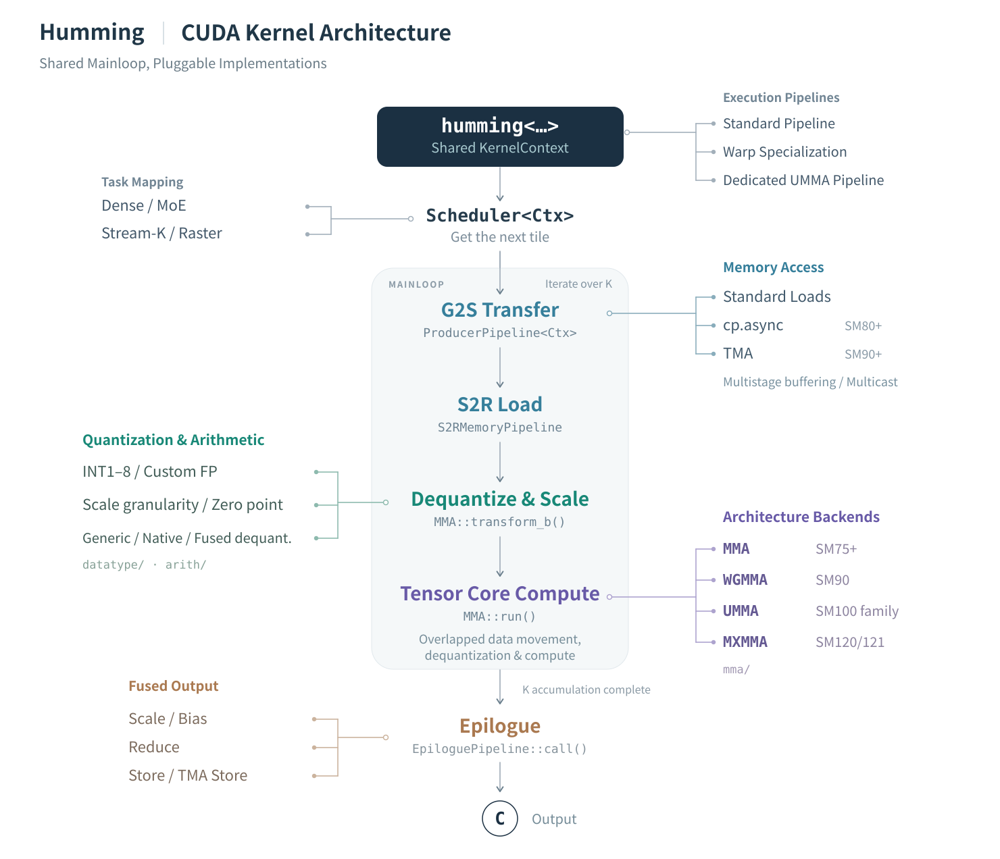

# Announcing Humming: Fast, Flexible Kernels for Quantized Inference

Humming is a JIT-compiled GEMM kernel library for quantized dense and mixture-of-experts (MoE) inference, built around a common quantization representation and reusable CUDA components.

## Background

As models and inference workloads grow, memory capacity, memory bandwidth, and compute costs increasingly constrain deployment. This is especially apparent in MoE models: each token activates only a subset of experts, but the full set of weights still needs to be stored. DeepSeek-V3, for example, has 671 billion parameters, with 37 billion activated per token. Quantization lowers the precision of weights and activations to reduce memory usage and data movement, and can also improve compute efficiency.

Quantization requirements vary across models and GPU generations. Common configurations include WNA16, W8A8, W4A8, and W4A4, where W and A specify weight and activation bit widths, and N denotes a variable weight bit width. Even at the same precision, schemes such as INT4 and NVFP4 differ in numeric format and scaling. Scaling granularity, scale representation, group size, and symmetric or asymmetric quantization further expand the configuration space.

These storage and compute savings only translate into lower latency and higher throughput with efficient kernels. Prefill, decode, and varying MoE expert loads place different demands on compute and memory. Kernels must adapt to these workloads while keeping conversion, dequantization, and scheduling overhead low.

Developing and integrating a dedicated kernel for every combination creates a growing maintenance burden. Each addition can require its own weight preprocessing, kernel selection, framework adapters, and tests. Optimizations must then be carried across multiple implementations.

Humming addresses this problem by separating quantization descriptions from execution choices and composing kernels from shared components.

## General-Purpose Architecture

Humming's execution path has three parts: represent the quantized computation, select configurations for the hardware and workload, and compile a kernel from CUDA components.

### A Unified Quantization Representation

Models exported by different quantization tools vary in numeric format, parameter organization, and weight layout. Humming converts supported export formats into the Humming standard format: a common quantization description with consistently organized weights, scales, zero points, and other tensors.

  

This representation preserves each scheme's quantization semantics while describing weight format, scaling granularity, scale data type, zero points, and secondary scales as separate parameters. Activations have their own numeric format and quantization settings. These parameters can be combined subject to format and hardware constraints.

For example, groupwise INT4 weights can be paired with BF16 activations. Low-precision floating-point weights with different scaling schemes use the same parameter system. This gives inference frameworks a common interface for models from different sources.

### Tuning and JIT Compilation for Each Workload

The standard format provides a common representation across export formats. Preprocessing then validates parameters, pads dimensions, and repacks these tensors into layouts suited to the target kernel. Humming combines the quantization description with the weight shape, GEMM type, target GPU, and compute options to configure execution.

  

Three configurations describe the kernel:

- **Layer Config** describes tensor shapes, data types, quantization parameters, and the target architecture.
- **Compute Config** specifies the GEMM type and computation options, such as batch invariance and input scale layout.
- **Tuning Config** selects tile shapes, pipeline stage counts, warp specialization, memory access, and MMA instructions. It also controls concurrency and scheduling; TMA can be configured per tensor.

By default, Humming selects tuning configurations using device-specific heuristics. It can prepare different configurations for ranges of input sizes and dispatch to the appropriate kernel at runtime.

Humming’s unified architecture makes it straightforward to tune execution parameters and select pipelines for different workloads. At small batch sizes, a multistage pipeline using asynchronous copies (`cp.async`) and MMA can outperform a pipeline built around TMA and UMMA. At larger batch sizes, TMA and UMMA can offer better throughput. Humming accommodates both execution paths within the same configuration and component framework, allowing it to select the more effective strategy for each workload.

Together, the three configurations specialize kernels compiled with NVRTC or NVCC. Compiled kernels are cached for reuse. Inference combines the selected kernel with the preprocessed weights and runtime activations.

### Shared CUDA Components Across Formats and Architectures

At the CUDA level, Humming organizes task scheduling, data movement, dequantization and scaling, Tensor Core computation, and output processing into reusable components. It provides standard, warp-specialized, and dedicated UMMA pipelines. These pipelines share compatible components while using the dataflow and synchronization required by each execution strategy.

  

Each group of components handles a different source of variation:

- **Numeric processing handles quantization formats.** Decoding and arithmetic components account for bit width, integer or floating-point representation, scales, and zero points. Dequantization and scaling are integrated into the kernel's computation.
- **Memory and compute backends handle GPU architectures.** Humming selects data movement and Tensor Core implementations for the target architecture, using asynchronous copies, TMA, and multicast where supported.
- **Task mapping and scheduling handle dense and MoE workloads.** Each GEMM type uses the appropriate scheduling logic. Scaling and bias addition can also be fused into the output stage.

JIT compilation combines these components according to the three configurations and eliminates unused implementation branches. A new format or architecture can therefore be supported by extending the relevant components. Improvements to a shared component benefit compatible configurations, reducing the duplicated development and maintenance of separate specialized kernels.

## Performance Engineering

TODO: Describe Humming's performance optimization work.

## Usage

TODO: Show how to use Humming directly and in vLLM, including basic environment variable settings.

## Results

### Broad Device Support

TODO: Describe full support for Turing / Ampere / Ada Lovelace / Hopper / Blackwell (/ Rubin).

### Quantization Support

### Performance

TODO: Compare performance against representative baselines on each device, including cuBLAS / Marlin / FlashInfer / TensorRT-LLM / hpc-ops.
