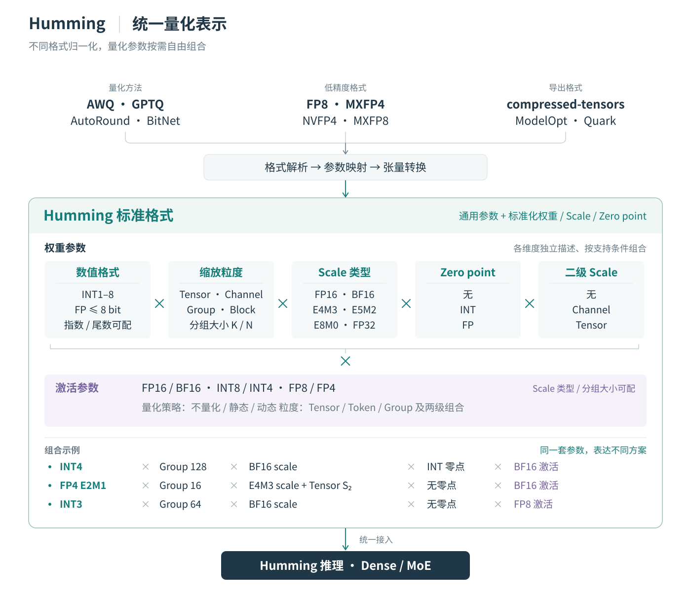
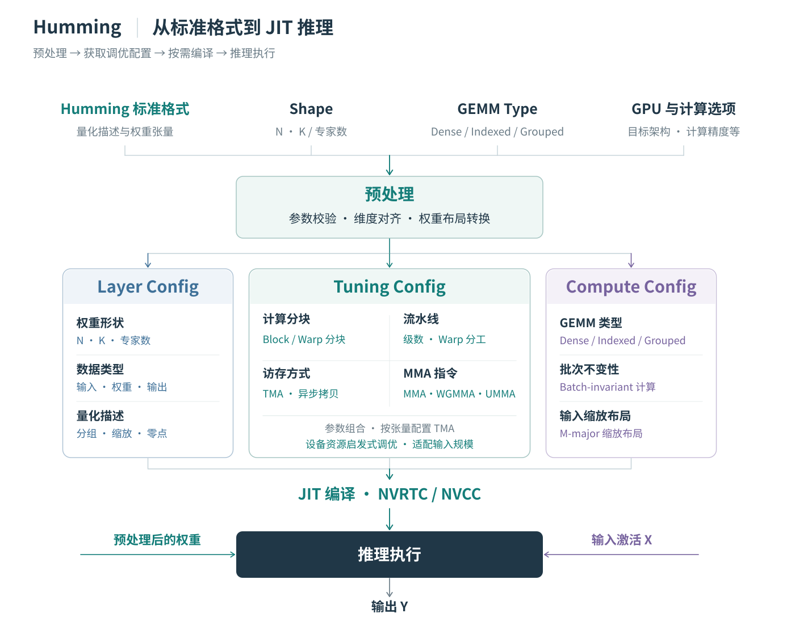
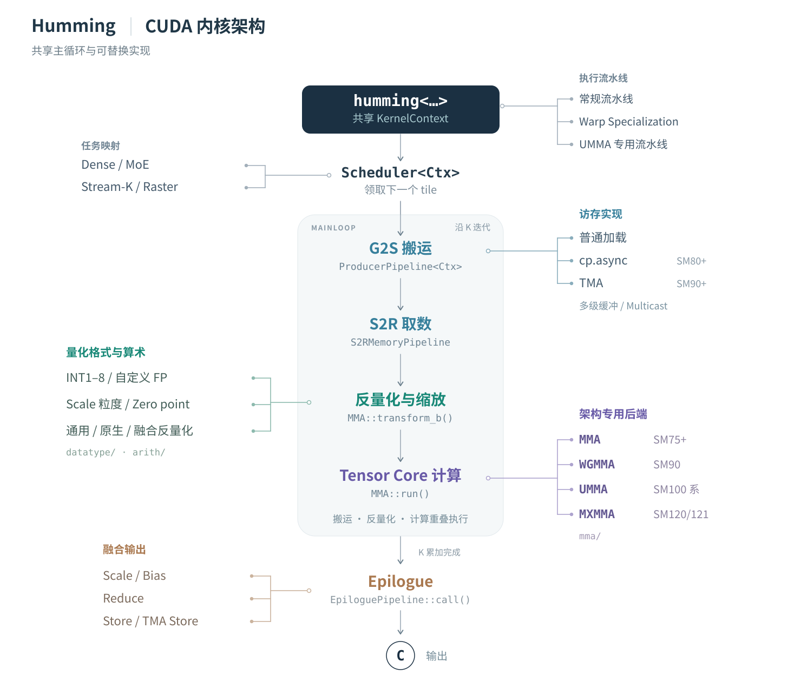

# Humming：高性能、灵活的量化推理内核

Humming 是面向 Dense 与混合专家（MoE）量化推理的 JIT 编译 GEMM 内核库，基于统一的量化表示和可复用的 CUDA 组件构建。

## 背景

随着模型规模与推理负载的增长，显存容量、访存带宽和计算成本日益成为部署的制约因素。这一问题在 MoE 模型中尤为明显：每个 token 只激活部分专家，但仍需存储全部权重。例如，DeepSeek-V3 拥有 6710 亿参数，每个 token 激活其中的 370 亿。量化通过降低权重与激活的表示精度，减少显存占用和数据搬运，也有助于提高计算效率。

不同模型和 GPU 架构的量化需求各不相同。常见配置包括 WNA16、W8A8、W4A8 和 W4A4，其中 W 和 A 分别标识权重与激活的位宽，N 表示可变的权重位宽。即使位宽相同，INT4 和 NVFP4 等方案在数值格式和缩放方式上也存在差异。缩放粒度、缩放因子的表示方式、分组大小，以及对称或非对称量化进一步扩大了配置空间。

这些存储与计算上的收益需要通过高效内核，才能转化为更低的延迟和更高的吞吐。Prefill、Decode 和不同的 MoE 专家负载对计算与访存有不同要求。内核既要适应这些负载，也要控制数据转换、反量化和调度的开销。

为每种组合开发并接入专用内核，会带来不断增长的维护负担。每新增一种组合，都可能需要独立的权重预处理、内核选择、框架适配和测试，已有优化也需要同步到多个实现中。

Humming 将量化描述与执行策略分离，并通过共享组件构建内核，以应对这一问题。

## 通用架构

Humming 的执行路径包含三个环节：表示量化计算，根据硬件与负载选择配置，再通过 CUDA 组件编译生成内核。

### 统一量化表示

不同量化工具导出的模型在数值格式、参数组织和权重布局上各有差异。Humming 将支持的导出格式转换为 Humming 标准格式：一组通用的量化描述，以及按统一约定组织的权重、缩放因子、零点和其他张量。

  

这一表示保留各方案的量化语义，将权重格式、缩放粒度、缩放因子的数据类型、零点和二级缩放因子分别表示为独立参数。激活拥有自己的数值格式与量化设置。这些参数可以在格式与硬件约束内组合。

例如，采用分组缩放的 INT4 权重可以搭配 BF16 激活；采用不同缩放方式的低精度浮点权重也使用同一套参数体系。这为推理框架处理不同来源的模型提供了统一接口。

### 按负载调优与 JIT 编译

标准格式为不同导出格式提供统一表示。随后，预处理完成参数校验、维度对齐，并将这些张量重排为适合目标内核的布局。Humming 结合量化描述、权重形状、GEMM 类型、目标 GPU 和计算选项，确定执行配置。

  

内核由三类配置描述：

- **Layer Config** 描述张量形状、数据类型、量化参数和目标架构。
- **Compute Config** 指定 GEMM 类型和计算选项，例如批次不变性与输入缩放布局。
- **Tuning Config** 选择分块形状、流水线级数、Warp 分工模式、访存方式和 MMA 指令，同时控制并发与调度；TMA 可按张量独立配置。

默认情况下，Humming 根据设备特定的启发式规则选择调优配置。它可以为不同输入规模区间准备不同配置，并在运行时分派到合适的内核。

Humming 的统一架构使其能够方便地为不同负载调整执行参数、选择流水线。在小批量下，使用异步拷贝（`cp.async`）和 MMA 的多级流水线可能优于基于 TMA 与 UMMA 的流水线；在大批量下，TMA 与 UMMA 则可能提供更高的吞吐。Humming 在同一套配置与组件框架内支持这两种执行路径，从而为不同负载选择更有效的策略。

这三类配置共同用于特化由 NVRTC 或 NVCC 编译的内核，编译结果会被缓存以供复用。推理时，选定的内核使用预处理后的权重和运行时激活完成计算。

### 跨格式与架构共享 CUDA 组件

在 CUDA 层，Humming 将任务调度、数据搬运、反量化与缩放、Tensor Core 计算和输出处理组织为可复用组件，并提供常规流水线、Warp Specialization 流水线和 UMMA 专用流水线。这些流水线共享适用的组件，同时采用各自执行策略所需的数据流与同步方式。

  

各组组件分别处理不同来源的差异：

- **数值处理组件适配量化格式。** 解码与算术组件处理位宽、整数或浮点表示、缩放因子和零点等差异，反量化与缩放融入内核计算过程。
- **访存与计算后端适配 GPU 架构。** Humming 根据目标架构选择数据搬运与 Tensor Core 实现，并在支持的场景中使用异步拷贝、TMA 和多播。
- **任务映射与调度适配 Dense 和 MoE 负载。** 每种 GEMM 类型采用相应的调度逻辑，缩放和偏置加法也可以融合到输出阶段。

JIT 编译依据三类配置组合这些组件，并消除未使用的实现分支。因此，支持新格式或新架构可以通过扩展相关组件完成。共享组件的改进能够使适用的配置受益，减少多套专用内核带来的重复开发与维护。

## 性能优化

TODO: 介绍 Humming 在性能优化方面做的工作。

## 使用方法

TODO: 介绍 Humming 的独立使用方式及在 vLLM 中的用法，包括基本环境变量设置等。

## 结果

### 广泛的设备支持

TODO: 介绍对 Turing / Ampere / Ada Lovelace / Hopper / Blackwell（/ Rubin）的完整支持。

### 量化支持

### 性能

TODO: 在各种设备上选取有代表性的 baseline 对比性能，包括 cuBLAS / Marlin / FlashInfer / TensorRT-LLM / hpc-ops。
